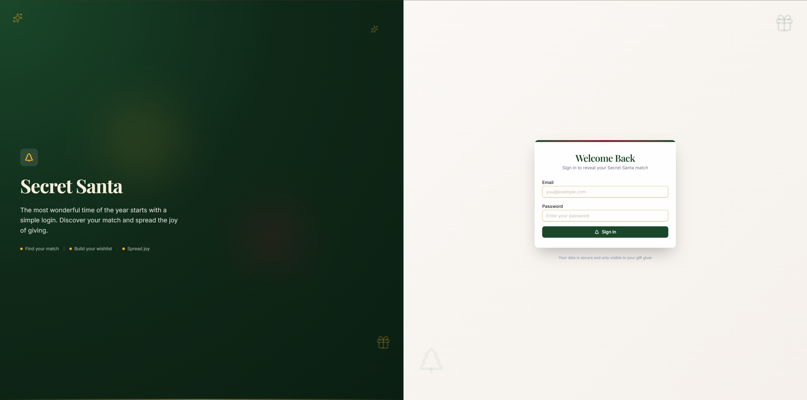
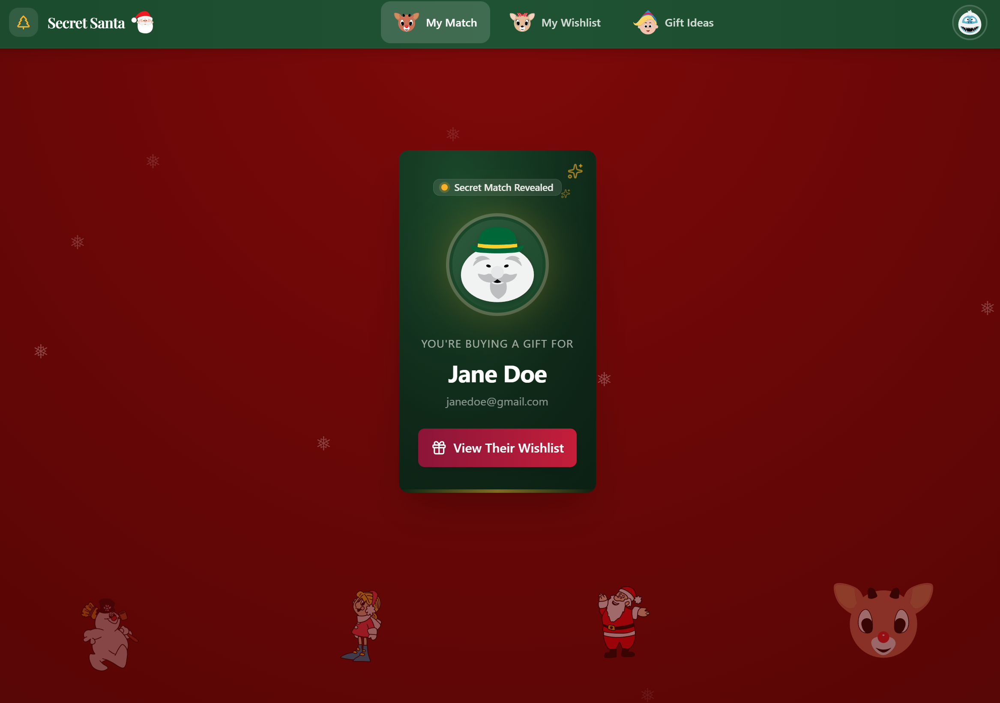
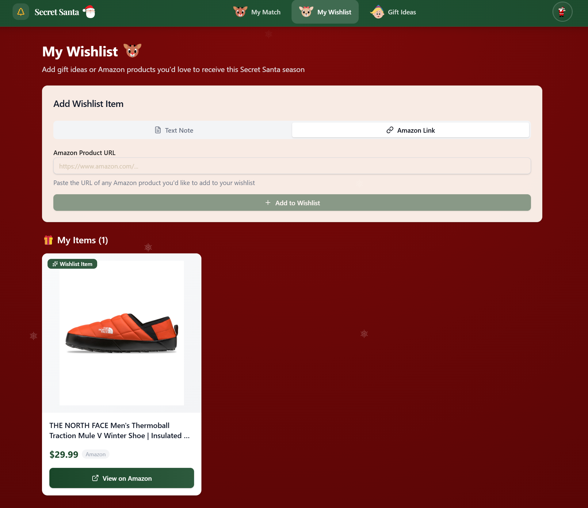
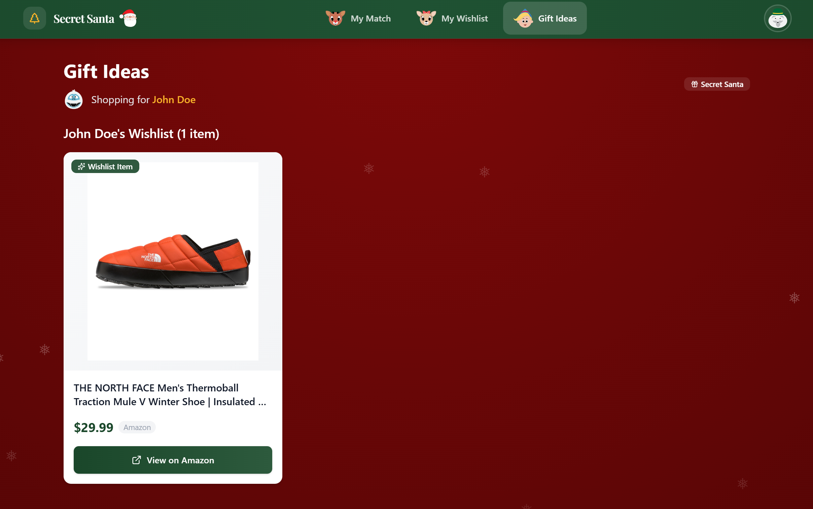
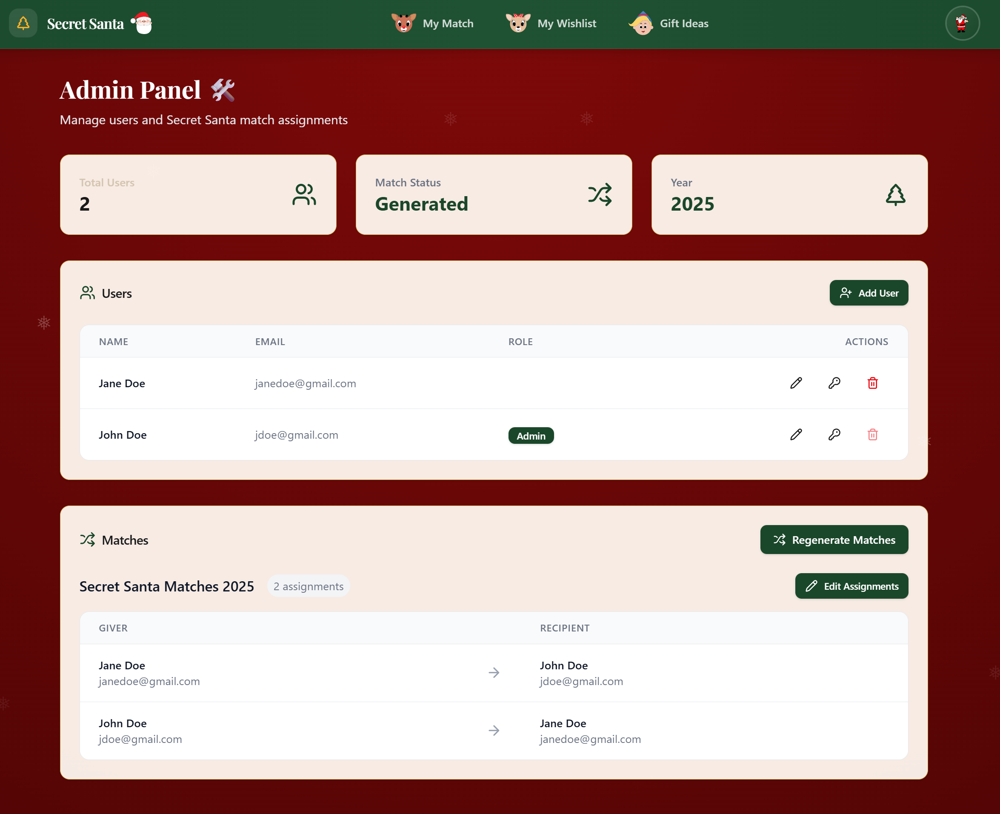

# Secret Santa

A festive web application for organizing Secret Santa gift exchanges with your family or friends.

| Login                     | My Match                       |
| ------------------------- | ------------------------------ |
|  |  |

| My Wishlist                          | Gift Ideas                         |
| ------------------------------------ | ---------------------------------- |
|  |  |

| Admin Panel                          |
| ------------------------------------ |
|  |

## Features

- **Secret Match Reveal** - Animated first-time reveal of your Secret Santa recipient
- **Wishlist Management** - Add Amazon product URLs with automatic title/price/image scraping
- **Recipient Wishlist** - View your recipient's wishlist to find the perfect gift
- **Email Notifications** - Participants get notified when matches are made and wishlists updated
- **Admin Panel** - Manage users, generate random match assignments, reset passwords

---

## AI-Assisted Installation (Easiest!)

Let an AI assistant install Secret Santa for you! Works with:

- **[Claude Code](https://claude.ai/code)** - Anthropic's coding assistant
- **[Gemini CLI](https://github.com/google-gemini/gemini-cli)** - Google's AI terminal
- **[OpenAI Codex](https://openai.com/codex)** - OpenAI's coding AI

Just open your AI assistant in this project folder and say:

```
Help me install Secret Santa @AGENTS.md
```

The AI will:

1. Ask which installation method you prefer (local Docker or cloud)
2. Check if you have the required software
3. Set up your configuration file
4. Create your admin account
5. Get everything running!

---

## Quick Deploy (One-Click)

Deploy instantly to a cloud provider:

[](https://railway.app/template/secret-santa?referralCode=secret-santa)

[](https://render.com/deploy?repo=https://github.com/YOUR_USERNAME/secret-santa)

> After deploying, you'll need to set your environment variables (see [Email Setup](#step-3-set-up-email-optional-but-recommended) below).

---

## Self-Host Guide

Host Secret Santa on your own computer or server. Perfect for keeping your family's data private!

### What You'll Need

- A computer (Windows, Mac, or Linux)
- Docker Desktop (free) - [Install Guide](#step-1-install-docker)
- A Gmail account (for email notifications)
- About 10 minutes

---

### Step 1: Install Docker

Docker runs the app in a container, so you don't need to install anything else.

| Operating System | Download Link                                                                          |
| ---------------- | -------------------------------------------------------------------------------------- |
| **Windows**      | [Docker Desktop for Windows](https://docs.docker.com/desktop/install/windows-install/) |
| **Mac**          | [Docker Desktop for Mac](https://docs.docker.com/desktop/install/mac-install/)         |
| **Linux**        | [Docker Engine for Linux](https://docs.docker.com/engine/install/)                     |

After installing:

1. Open Docker Desktop
2. Wait for it to start (you'll see "Docker Desktop is running" in the system tray/menu bar)

---

### Step 2: Download Secret Santa

**Option A: Using Git (if you have it installed)**

```bash
git clone https://github.com/YOUR_USERNAME/secret-santa.git
cd secret-santa
```

**Option B: Download ZIP**

1. Click the green "Code" button at the top of this page
2. Click "Download ZIP"
3. Extract the ZIP to a folder (e.g., `C:\secret-santa` or `~/secret-santa`)
4. Open a terminal/command prompt in that folder

---

### Step 3: Set Up Email (Optional but Recommended)

Email notifications let participants know when matches are assigned and when wishlists are updated. The app works without email, but participants won't receive notifications.

#### How to Create a Gmail App Password

> **Why an App Password?** Google requires special passwords for apps to keep your account secure. This is a one-time setup.

1. **Go to your Google Account Security page**
   - Open: https://myaccount.google.com/security

2. **Enable 2-Step Verification** (if not already enabled)
   - Under "How you sign in to Google", click **2-Step Verification**
   - Follow the prompts to enable it

3. **Create an App Password**
   - Go to: https://myaccount.google.com/apppasswords
   - You may need to sign in again
   - Under "Select app", choose **Mail**
   - Under "Select device", choose **Other (Custom name)**
   - Type: `Secret Santa`
   - Click **Generate**

4. **Copy the password**
   - You'll see a 16-character password like: `abcd efgh ijkl mnop`
   - Copy this password (you can remove the spaces)

5. **Save it in your config file** (next step)

---

### Step 4: Configure Your Settings

1. **Copy the example config file:**

   **Mac/Linux:**

   ```bash
   cp server/.env.example server/.env
   ```

   **Windows (Command Prompt):**

   ```cmd
   copy server\.env.example server\.env
   ```

2. **Edit the config file** (`server/.env`):

   Open in any text editor (Notepad, TextEdit, VS Code, etc.) and update these values:

   ```env
   NODE_ENV=production
   PORT=3001
   CLIENT_URL=http://localhost:3001

   # Your Gmail credentials (from Step 3)
   EMAIL_USER=your-gmail@gmail.com
   EMAIL_PASS=abcdefghijklmnop
   ```

   > **Note:** Remove any spaces from the App Password

---

### Step 5: Start the App

Run this single command:

```bash
docker-compose up -d
```

Wait about 30 seconds for everything to start, then open your browser to:

**http://localhost:3001**

> **Tip:** To check if it's running: `docker-compose logs -f`
> Press `Ctrl+C` to stop viewing logs (the app keeps running)

---

### Step 6: Create Your Admin Account

The first user needs to be created via command line:

```bash
docker exec -it secret-santa bun scripts/create-admin.ts
```

You'll be prompted to enter:

- Email address
- Display name
- Password

This account can manage users and generate Secret Santa matches!

---

### Step 7: Add Family Members

1. Log in with your admin account
2. Go to the **Admin** tab
3. Click **Add User** for each family member
4. Share their login credentials (they'll receive a welcome email if you set up email)

---

### Step 8: Generate Matches

When everyone is added:

1. Go to the **Admin** tab
2. Click **Generate Matches**
3. Everyone gets assigned a random Secret Santa!

---

## Share With Family (Remote Access)

Want family members to access the app from their own homes? Here are three options:

### Option A: Cloudflare Tunnel (Recommended)

Free, secure, and doesn't expose your home IP address.

1. **Create a Cloudflare account** at https://cloudflare.com

2. **Install cloudflared:**
   - **Mac:** `brew install cloudflare/cloudflare/cloudflared`
   - **Windows:** [Download installer](https://developers.cloudflare.com/cloudflare-one/connections/connect-apps/install-and-setup/installation/)
   - **Linux:** `curl -L https://pkg.cloudflare.com/cloudflared-stable-linux-amd64.deb -o cloudflared.deb && sudo dpkg -i cloudflared.deb`

3. **Login to Cloudflare:**

   ```bash
   cloudflared tunnel login
   ```

4. **Create a tunnel:**

   ```bash
   cloudflared tunnel create secret-santa
   ```

5. **Run the tunnel:**

   ```bash
   cloudflared tunnel --url http://localhost:3001
   ```

   You'll get a URL like `https://random-words.trycloudflare.com` - share this with family!

> **Tip:** For a permanent custom domain, follow [Cloudflare's full tunnel guide](https://developers.cloudflare.com/cloudflare-one/connections/connect-apps/).

---

### Option B: Tailscale (Easiest for Tech-Savvy Families)

Every family member installs Tailscale, creating a private network.

1. **Install Tailscale** on your computer: https://tailscale.com/download
2. **Create an account** and connect your device
3. **Note your Tailscale IP** (looks like `100.x.x.x`)
4. **Have family install Tailscale** on their devices
5. **Share the URL:** `http://100.x.x.x:3001`

> Everyone needs Tailscale installed, but it's very secure and easy.

---

### Option C: Port Forwarding (Advanced)

Opens a port on your router. Less secure, but works without extra software.

1. **Find your local IP:**
   - **Mac/Linux:** `ifconfig | grep "inet "`
   - **Windows:** `ipconfig`
   - Look for something like `192.168.1.x`

2. **Log into your router** (usually http://192.168.1.1)

3. **Set up port forwarding:**
   - External port: `3001`
   - Internal IP: Your computer's IP (e.g., `192.168.1.100`)
   - Internal port: `3001`

4. **Find your public IP:** https://whatismyip.com

5. **Update your config** (`server/.env`):

   ```env
   CLIENT_URL=http://YOUR_PUBLIC_IP:3001
   ```

6. **Share the URL:** `http://YOUR_PUBLIC_IP:3001`

> **Warning:** Your public IP may change. Consider using a dynamic DNS service like [DuckDNS](https://www.duckdns.org/) or [No-IP](https://www.noip.com/).

---

## Managing Your App

### View Logs

```bash
docker-compose logs -f
```

### Stop the App

```bash
docker-compose down
```

### Restart the App

```bash
docker-compose restart
```

### Update to Latest Version

```bash
git pull
docker-compose down
docker-compose build --no-cache
docker-compose up -d
```

---

## Troubleshooting

### "Docker is not running"

Make sure Docker Desktop is open and shows "Docker Desktop is running" in the system tray.

### "Cannot connect to localhost:3001"

1. Check if the container is running: `docker ps`
2. Check the logs for errors: `docker-compose logs`
3. Make sure port 3001 isn't used by another app

### "Emails aren't sending"

1. Double-check your Gmail App Password (no spaces)
2. Make sure 2-Step Verification is enabled on your Google account
3. Check the logs: `docker-compose logs | grep -i email`

### "Cannot create admin user"

Make sure the container is running:

```bash
docker-compose up -d
docker exec -it secret-santa bun scripts/create-admin.ts
```

### "Permission denied" errors on Linux

Run Docker commands with `sudo`, or add your user to the docker group:

```bash
sudo usermod -aG docker $USER
```

Then log out and back in.

---

## For Developers

<details>
<summary>Click to expand development setup</summary>

### Tech Stack

**Frontend:** React 19, TypeScript, Vite 6, Tailwind CSS 4, Framer Motion, shadcn/ui

**Backend:** Express, TypeScript, SQLite (better-sqlite3), bcrypt, cheerio

### Development Setup

**Prerequisites:** Node.js 20+, Bun (for client)

**Server:**

```bash
cd server
npm install
npm run dev # Runs on port 3001
```

**Client:**

```bash
cd client
bun install
bun run dev # Runs on port 5173
```

### Project Structure

```
secret-santa/
├── client/              # React frontend
│   ├── src/
│   │   ├── components/  # UI components
│   │   ├── pages/       # Page components
│   │   ├── hooks/       # Custom React hooks
│   │   └── lib/         # Utilities
├── server/              # Express backend
│   ├── routes/          # API endpoints
│   ├── middleware/      # Auth middleware
│   ├── db/              # Database schema
│   └── services/        # Email service
└── docker-compose.yml
```

### Test Credentials

- **Email:** admin@test.com
- **Password:** password123

</details>

---

## License

MIT
